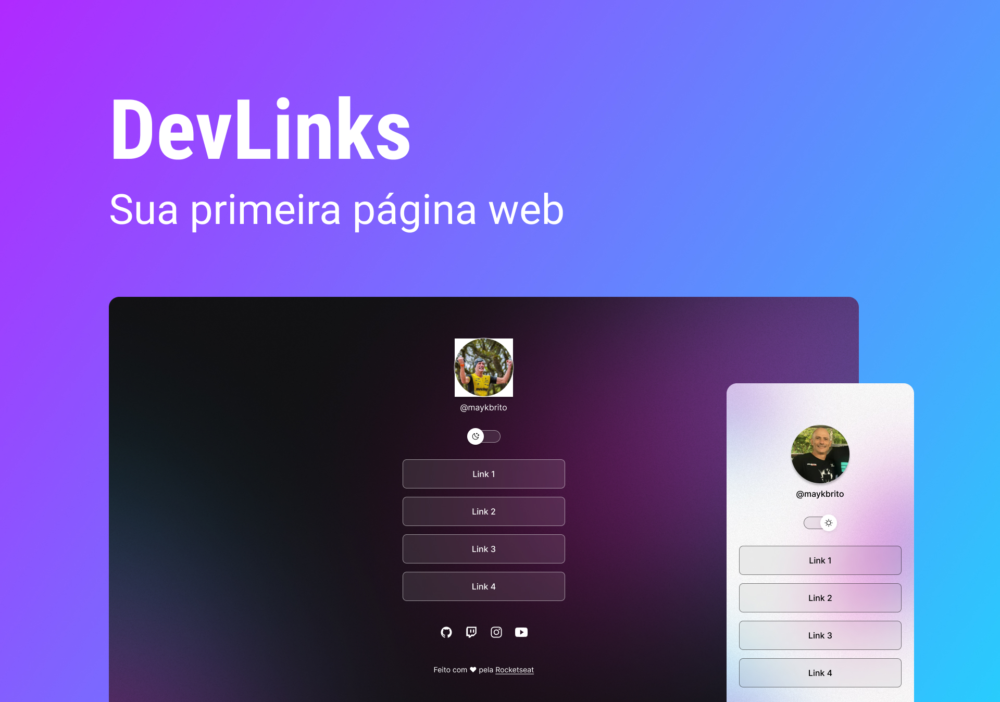

## Projeto DevLinks
 

<h1 align="center"> DevLinks</h1>

Programa exclusivo e gratuito promovido pela Rocketseat para ensino e desenvolvimento de tecnologias WEB.

 

    <a href="#-tecnologias">Tecnologias</a>&nbsp; &nbsp; &nbsp; |&nbsp; &nbsp; &nbsp;
    <a href="#-projeto">Projeto</a>&nbsp; &nbsp; &nbsp; |&nbsp; &nbsp; &nbsp;
    <a href="#-lauout">Layout</a>&nbsp; &nbsp; &nbsp; &nbsp; &nbsp; &nbsp;

 

    

 

## Tecnologias 

Este projrto foi desenvolvido com as seguintes tecnologias:

- HTML e CSS
- JavaScript
- Figma
- Git e Github

## Projeto

O DevLinks é um agregador de links para usar como cartão de visitas online.

- [Acesse o projeto finalizado, on line](https://cpieragnoli.github.io/Projeto-DevLinks/)

## Layout

Você pode visualizar o Layout do projeto através 
[Desse Link](https://www.figma.com/file/nWACw1dZwOdr1K0lU2wY6H/DevLinks-(Community)?node-id=90%3A160&t=rEbTSYsz5bvtVP5b-0). É necessário ter uma conta no [Figma](https://figma.com) para acessá-lo.

